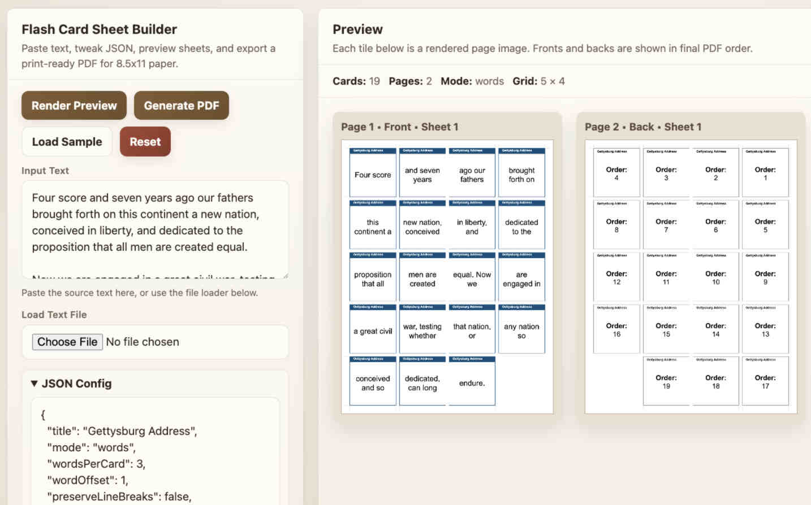

# Flash Card Sheet Maker

A tool for turning text into **printable flash card sheets**.

This project includes two versions that share the **same JSON configuration**:

- **Web App (GitHub Pages)** – paste text, preview cards, and generate PDFs in the browser.
- **Node.js CLI** – generate PDFs directly from the command line.

Both versions use the same layout engine and configuration format, so settings can be shared between them.

---

# Live Web Version

This repository is hosted on GitHub Pages. You can open:

```
https://lewismoten.github.io/Flash-Card-Sheet-Maker/
```

The web version allows you to:

- Paste text
- Edit JSON configuration
- Preview printable sheets
- Generate a PDF
- Save settings locally in your browser

No server required.

---

# Features

- Generate **uniform flash cards on 8.5×11 sheets**
- **Preview pages before printing**
- Works **entirely offline**
- **Word grouping**, **sentence grouping**, or **line grouping**
- **Word offset** for phrase alignment
- **Anchor phrase highlighting** with square bracket markup
- Optional **punctuation handling**
- Multiple **card order display styles**
- **Automatic text wrapping and scaling**
- **Cut marks** for trimming
- **Duplex printing support**
- Works in **browser or Node.js**

---

# Installation

## Web Version

Simply open: `index.html`

Or use the GitHub Pages deployment.

All processing happens locally in your browser.

Sample Text: Declaration of Independence (1776)

---

## Node.js Version

Requirements:

- Node.js 18+

Install dependency:

```bash
npm install pdf-lib
```

Run the generator:

```bash
node src/index.js
```

Specify files:

```bash
node src/index.js config.json input.txt cards.pdf
```

---

# Basic Usage

Input text example:

```
Cut the cards apart and shuffle them.

Try to place them back into the correct order.
```

With this configuration:

```json
{
  "wordsPerCard": 3
}
```

Cards become:

```
Cut the cards
apart and shuffle
them Try to
place them back
into the correct
order
```

---

# JSON Configuration

The generator is controlled entirely through a **JSON configuration file**.

Example minimal configuration:

```json
{
  "title": "Example Flash Cards",
  "mode": "words",
  "wordsPerCard": 3,
  "wordOffset": 1,
  "transform": "none"
}
```

---

# Text Processing Options

## mode

Controls how text is grouped.

```json
{
  "mode": "words"
}
```

Options:

| Mode | Behavior |
|---|---|---|
words	| split text into word groups
sentences	| split by sentence
lines	| each line becomes a card

---

## preserveLineBreaks


Controls if groups of words are displayed with line-breaks
from the original text.

```json
{
  "preserveLineBreaks": "false"
}
```

## wordsPerCard

Number of words placed on each card.

```json
{
  "wordsPerCard": 3
}
```

Example output:

```
The quick brown
fox jumps over
the lazy dog
```

---

## wordOffset

Offsets the first card so phrases align naturally.

Example:

```
wordsPerCard: 3
wordOffset: 1
```

Result:

```
The quick
brown fox jumps
over the lazy
dog
```

---

## transform

Changes text casing.

```json
{
  "transform": "none"
}
```

Options:

| Mode | Behavior |
|---|---|---|
none	| Text appears in OrIgInAl form
upper	| TEXT APPEARS IN UPPER CASE FORM
lower	| text appears in lower case form
title | Text Appears In Title Cased form

---

## Anchor Phrases

Words or phrases surrounded by square brackets can be highlighted on the front of a card.

Example source text:

```text
We hold these truths 
to be [self-evident],
that all men are [created equal],
```

Example Output:

* We hold these
* **truths** to be
* **self-evident** that all
* men are
* **created equal**

With the anchor phrase highlighted according to the configured style.
```json
{
  "anchors": {
    "enabled": true,
    "style": "bold-color",
    "color": "#8B0000"
  }
}
```

### Anchor Options

| Property | Description |
| --- | --- |
| enabled | enables anchor highlighting |
| style | bold, color, or bold-color |
| color | hex color used when color highlighting is enabled |

### Notes

* Anchor markup works in both the web and Node.js versions.
* Bracketed phrases stay together visually and can be highlighted as a single phrase.
* In word mode, bracketed phrases are counted by the number of words they contain, not as a single word.

---

## Punctuation Options

```json
{
  "removePunctuation": false,
  "separatePunctuation": false
}
```

| Setting | Behavior |
|-------|--------|
removePunctuation | removes punctuation |
separatePunctuation | punctuation becomes its own card |

---

# Page Layout

```json
{
  "page": {
    "rows": 4,
    "cols": 3,
    "margin": 24,
    "gutter": 10
  }
}
```

Controls the sheet layout.

Example:

```json
{
  "rows": 4,
  "cols": 3
}
```

Creates **12 cards per page**.

---

# Cut Marks

```json
{
  "cutMarks": "outer"
}
```

Options:

```
outer
grid
none
```

| Mode | Behavior |
|----|----|
outer | only page edges |
grid | every card |
none | no marks |

---

# Card Appearance

```json
{
  "card": {
    "bodyFontSize": 22,
    "bodyMinFontSize": 10,
    "borderColor": "#1F4E79",
    "borderWidth": 1
  }
}
```

Important settings:

| Property | Description |
|------|------|
bodyFontSize | starting font size |
bodyMinFontSize | minimum allowed |
borderColor | card outline |
borderWidth | outline thickness |
padding | inner spacing |

---

# Duplex Printing

Enable card backs.

```json
{
  "duplex": {
    "enabled": true
  }
}
```

This produces:

```
Page 1  Front
Page 2  Back
Page 3  Front
Page 4  Back
```

Designed for **double‑sided printing**.

---

# Card Order Display

When phrases repeat, the back of the card can show **multiple positions**.

Example:

```
Order: 3, 9, 14
```

---

## backOrderStyle

```json
{
  "backOrderStyle": "smart"
}
```

Options:

| Style | Behavior |
|-----|------|
wrap | wraps long lists |
context | shows nearby positions |
single | single long line |
count | show total occurrences |
smart | automatic switching |

---

## Context Mode Example

```
Order: ..., 19, 23, [27], 31, 36, ...
```

The current card position is highlighted when the same text appears in multiple locations.

---

# Example Configuration

```json
{
  "title": "Example Flash Cards",
  "mode": "words",
  "wordsPerCard": 3,
  "wordOffset": 1,
  "transform": "none",
  "page": {
    "rows": 4,
    "cols": 3,
    "margin": 24,
    "gutter": 10,
    "cutMarks": "outer"
  },
  "card": {
    "bodyFontSize": 22,
    "bodyMinFontSize": 10,
    "padding": 10,
    "borderColor": "#1F4E79"
  },
  "duplex": {
    "enabled": true,
    "backOrderStyle": "smart"
  }
}
```

---

# Example Uses

This tool is useful for:

- memorization exercises
- speech practice
- language learning
- classroom activities
- puzzle reconstruction
- script rehearsal
- ritual memorization
- study aids

---

# Screenshots



---

# Project Structure

```bash
flash-card-sheet-maker
│
├── index.html        # Web interface
├── index.css         # Web styles
├── index.js          # Web logic
│
├── src/              # Node: Logic
│   ├── index.js      # Node: Main entry point
│   ├── buildCards.js
│   ├── drawFlashCard.js
│   ├── drawBackCard.js
│   ├── drawCutMarks.js
│   ├── makePdf.js
│   └── more...
│
├── input.txt          # Node: default input text
├── config.json        # Node: default configuration
├── cards.pdf          # Node: default output
└── README.md
```

---

# Development

If modifying the Node.js generator:

```bash
node src/index.js config.json input.txt cards.pdf
```

If modifying the web version:

```bash
open index.html
```

Both share the same layout logic and configuration format.

---

# License

MIT
